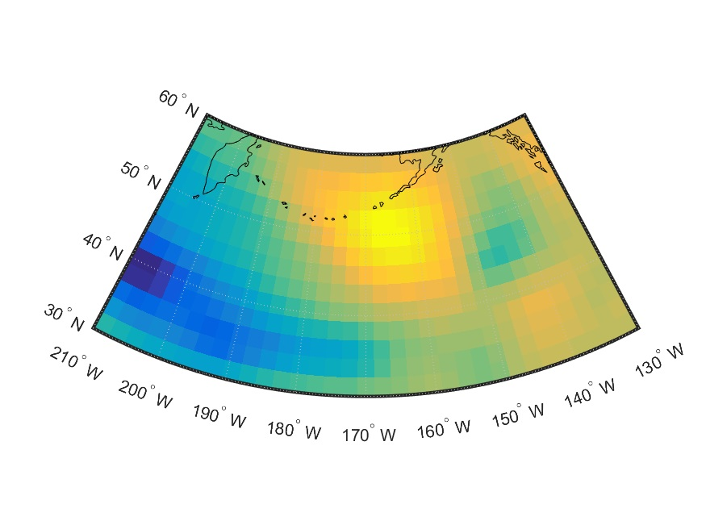

# May 2017
# GeoPlot Function for Sea Level Pressure

### Function Description

GeoSLP is used to transform and create a video of sea level pressure data plotted on world map. GeoSLP reads information of latitude, longtitude, sea level pressure matrix from NC files downloaded from NCEP website, then  converting them into mat files. Based on ranges of latitude and longitude, create part of world map with coastlines and plot data with raster reference and geoshow.
